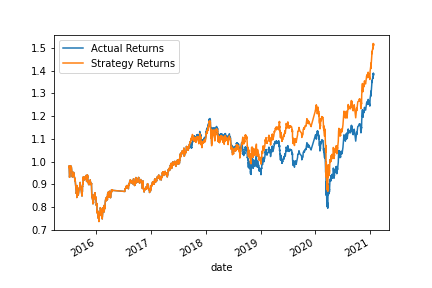

# Assignment 14

## Objective:
The main goal of this exercise is to create a Financial Model to analyze stock market evolution and define Buy and Sell strategies.

With that in mind we create a Buy/Sell strategy based on the signal we would have by analyzing moving averages.

Thus, the initial model was created assuming:
 - Training data: first 3 months
 - Short Moving Average: 4 days
 - Large Moving Average: 100 days

 The result of the model is show below.

 

---

## What impact resulted from increasing or decreasing the training window?

In order to evaluate what woud be the best parameters for the model we have adjusted the length of the training data.

Below you can see a comparison table accross the different changes.

|Current Model|Model with 1 Month|Model with 6 Month|
|---|---|---|
||||

From all the images you can see **Strategy Returs** will somehow follow the Actual Returns. Nevertheless, in scenario 1 the curve is lagged. It means that the Strategy Returns happens more as a response to the data and not that much as predicting it.

For the initial model and the model with 6months data, we can see that both model can match Actual returns until around 2019. After that both model mimics the Actual Returns but cannot predict exactly.

With that said we have kept the training dataset in 3 months, since we are using less amount of data on the training set and get more or less the same results than the 6 month model.

---

## What impact resulted from increasing or decreasing either or both of the SMA windows?

In order to evaluate what woud be the best parameters for the model we have adjusted the length of both Short Moving Average and Large Moving Average.

The below tables will illustrate all comparisons I have made in order to find the sweet spot of tunning the initial model.

- **Changing Short Moving Average (SMA)**

|Current Model|SMA = 2D|SMA = 10D|
|---|---|---|
||||

By shortening and increasing the SMA we had better results than the initial model. By looking for the curves we kept the **SMA = 10D** has the best outcome of this particular analysis.

- **Changing Large Moving Average (LMA)**

|Current Model|LMA = 50D|LMA = 200D|
|---|---|---|
||||

By shortening and increasing the LMA we had worst results than the initial model. Thus we have kept the initial **LMA = 100D** has the strategy to follow.

- **Changing both LMA and SMA**

|Current Model|LMA = 100D & SMA = 10D|LMA = 200D & SMA = 30D|
|---|---|---|
||||

As we can see the parameters that works for this model is: **LMA = 100D & SMA = 10D**. Therefore we have used them as the best choice of parameters.

---

## Evaluate New Machine Learning Classifiers

The other ML Classifer evaluated during this assignment was Decision Tree Classifier.

The overall performance of it was worst than the tunned model with SVC (comparison on the below table), thus we have kept the initial model as the good one.

For both models we have used the same parameters:
 - Training data: first 3 months
 - Short Moving Average: 10 days
 - Large Moving Average: 100 days

 |SVC Model|Decision Tree Model|
|---|---|
|||