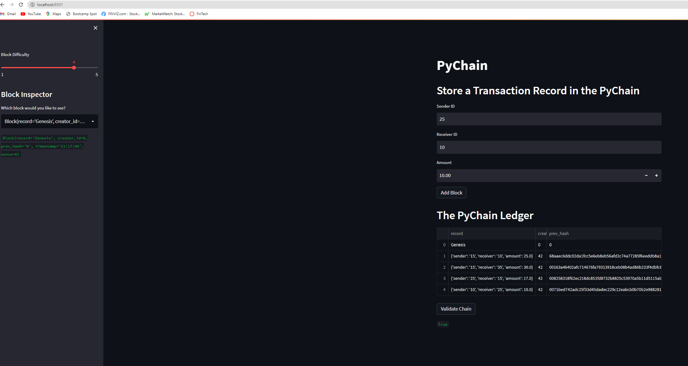

# Module 18 Challenge - PyChain

## Goal

The main objective of this challenge was to create a blockchain example using python libraries.

## PyChain

The image shows how you can define the sender, the receiver as well as the amount you want to transact, and therefore adding as a block to the chain.

Moreover, in the main screen you can see the Ledger associated to this BlockChain. By storing (ledger) all the transactions that were processed, you are able to validate if all the blocks correctly interconnect. If positive, then you can ensure the BlockChain is valid.

On top of the above features, on the side bar you can define the difficulty of the blockchain (between 0 and 5) and see more details once you select a specific transaction.

